# AI & Data Science Competition Portfolio


Welcome to my global competition portfolio! This repository serves as a centralized hub for all my competitive data science and AI endeavors, spanning **Natural Language Processing (NLP)**, **Computer Vision (CV)**, and **Machine Learning (ML)**.
It is my new year competition portfolio.
Previous portfolio can be found [here](https://github.com/yehoshua0/y_datascience_projects) and [there](https://github.com/yehoshua0/yhsml).

<p align="center">
  <a href="https://zindi.africa/users/yehoshua">
    
  </a>
  <a href="https://zindi.africa/users/yehoshua">
    
  </a>
  <a href="https://zindi.africa/users/yehoshua">
    
  </a>
  <br>
  <b>🏆 Zindi Performance 🏆</b><br>
  <i>Top Competitive Data Scientist at Zindi Africa</i>
</p>

## 📜 Top Achievement Certificates

<table align="center">
  <tr>
    <td align="center" width="50%">
      <a href="./certificates/Jack517-Togo%20Fiber%20Optics%20Uptake%20Prediction%20Challenge.png">
        
      </a>
      <br><br>
      <b>🥉 3rd Place — Togo Fiber Optics Uptake Prediction</b>
      <br>
      <sub>🇹🇬 Zindi · Ministry of Digital Economy (Togo) · June 2024</sub>
    </td>
    <td align="center" width="50%">
      <a href="./certificates/3LC%20Multi-Vehicle%20Detection%20ChallengeCertificate_Second%20Place.png">
        
      </a>
      <br><br>
      <b>🥈 2nd Place — 3LC Multi-Vehicle Detection</b>
      <br>
      <sub>🚗 Kaggle · 3LC.AI · June 2026</sub>
    </td>
  </tr>
</table>

<p align="center">
  <a href="./certificates/"><b>🗂️ Browse all 12 certificates →</b></a>
</p>

## 🏆 Featured Competitions

| Competition                                                                                       | Domain | Platform | Core Tech                       | Highlights                                                       |
| :------------------------------------------------------------------------------------------------ | :----- | :------- | :------------------------------ | :--------------------------------------------------------------- |
| **[Togo Fiber Optics Uptake](./zindi/togo-fiber-optics-uptake-prediction-challenge)**             | ML     | Zindi    | Tabular, Gradient Boosting      | Predicting fiber optic adoption in Togo. Award-winning entry.    |
| **[3LC Multi-Vehicle Detection](./kaggle/3lc-mvdc)**                                              | CV     | Kaggle   | Data-centric AI, YOLOv8n, 3LC   | 🥈 2nd Place (mAP@0.5 0.92016). [Live Streamlit demo](https://mvdc-heoshua.streamlit.app). |

---

## 🛠️ Repository Structure

Each competition is self-contained within its own directory following a standardized structure:

```text
Competition Name/
├── data/           # Datasets (sampled or links)
├── notebooks/      # Exploratory Data Analysis & Modeling
├── src/            # Productionized source code & utilities
├── scripts/        # Automation and data processing scripts
├── submissions/    # Final predictions and submission logs
└── README.md       # Detailed competition report and reproduction steps
```

---

## ⚙️ Deployment & Setup

Most projects use a standardized Python environment.

1.  **Clone the Repo:**
    ```bash
    git clone https://github.com/yehoshua0/competitions.git
    cd competitions
    ```
2.  **Environment Setup:**
    Check the `README.md` or `requirements.txt` within specific competition folders for dependency installation.

---

## 📢 They Talked About Me

- [🏆 We Have Our Winners! The 3LC.AI Cotton Weed Detection Challenge Has Concluded!](https://www.linkedin.com/posts/rishikesh-avinash-jadhav_machinelearning-computervision-objectdetection-activity-7404907853053894656-rG2h?utm_source=share&utm_medium=member_desktop&rcm=ACoAAEJj1SUB_L3iOMcPsW2TH2IBriNt5c5htPc) — **LinkedIn post** | December 10, 2025
- [Press release – Awards ceremony “AI Challenge: Predicting the adoption of fiber optics in Togo”](https://digital.gouv.tg/evenements/ceremonie-de-remise-de-prix-challenge-ia?lang=en) — **The Ministry of Digital Economy and Digital Transformation (MENTD), through the Togo Digital Agency (ATD) in collaboration with the Zindi Community** | October 18, 2024

---

## 📫 Connect with Me

- **LinkedIn:** [yehoshua1](https://www.linkedin.com/in/yehoshua1/)
- **Kaggle:** [aaaml007](https://www.kaggle.com/aaaml007)
- **Zindi:** [yehoshua](https://www.zindi.africa/yehoshua)
- **Portfolio Website:** [yehoshua.heoshua.com](http://yehoshua.heoshua.com/)

---

_Last Updated: 2026-07-23_
